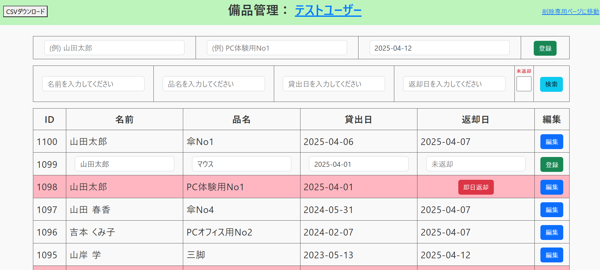
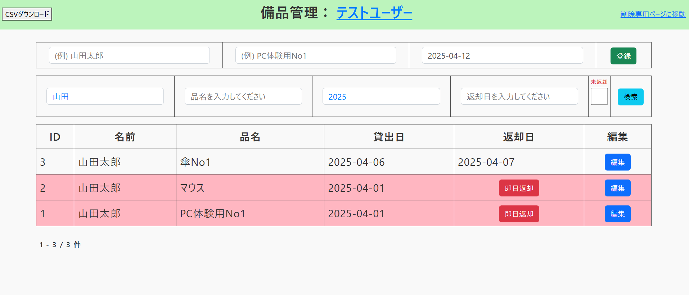

# 備品管理アプリ

ユーザーごとに備品の貸出・返却・管理ができるWebアプリです。Laravel + Vue.js を使って構築しています。

## 🔧 使用技術
- Laravel 12
- Vue.js 3.3
- PostgreSQL
- Bootstrap 5.3

## 📌 主な機能
### 🔐 ユーザー登録・ログイン（セッション管理）
ユーザーごとにデータを管理し、ログイン中のユーザーに紐づく備品データのみを表示します。

### 🔁 パスワード再設定機能（Mailtrap対応）
パスワードを忘れた際、再設定リンクを含むメールを送信できます。
※送信先は .env ファイルで設定された管理者アドレスに限定されており、開発時は Mailtrap によって確認できます。

### 📝 CRUD機能（登録・編集・削除）
備品の「名前」「品名」「貸出日」を登録し、誤入力時には編集・削除が可能です。
返却時は「即日返却」ボタンで簡単入力。

### 🔍 検索機能（複合条件 + オートサジェスト + フィルタ）
名前・品名に対して非同期オートサジェスト表示。
チェックボックスで「未返却のみ」フィルタも可能。
日付検索では部分一致（例：`2025` や `2025-01`）や、複数条件での AND 検索に対応。

### 📄 CSVダウンロード機能（Excel形式対応）
現在の検索結果に応じたデータを、降順で CSV としてダウンロード可能。
Excel でもそのまま開けます。

### 🧹 削除専用ページ
データ量増加に備え、一覧とは独立した「削除専用画面」を用意し、不要なデータの整理がしやすくなっています。

### 📋 貸出状況の表形式表示
テーブルレイアウトで、備品の現在状況や返却状況を一覧で確認できます。

## 🛠️ 苦労した点と解決方法
### パフォーマンスの改善
オートサジェスト機能の非同期通信においてレスポンスが遅くなったため、データベース構成を見直し、Supabaseへ移行することでパフォーマンスを改善しました。

### パスワードリセットの問題
デプロイ後、Mailtrapでパスワードリセット用リンク付きメールの受信は確認できたが、リンクをクリックすると403エラーが発生しました。
原因は、トークンを暗号化した状態で保存していたことにより、Laravelの照合処理と形式が一致せず、認証に失敗していたことでした。
暗号化処理を解除してプレーントークンに統一することで、パスワードリセット機能が正常に動作するよう修正しました。

## 🖼️ 画面定義書（Excel）
📄 [画面定義書をダウンロード](./docs/bihin-app_screen-definition.xlsx)

## 🖼️ アプリ画面例-編集

## 🖼️ アプリ画面例-検索

## 🚀 デプロイURL
🔗 [https://lending-system-apple.vercel.app/](https://lending-system-apple.vercel.app/)

## 🏢 想定利用シーン
就労移行支援アップル梅田にて、利用者へ貸し出す備品の管理業務を効率化するためのWebアプリ。

## 🧑‍💻 開発体制
個人開発（要件定義・設計・実装・テスト・デプロイまで一貫して対応）。

## 💡 工夫したポイント
ログイン中のユーザーに紐づくデータのみを表示するため、外部キーによるIDの再割り振りとセッション管理を活用し、ユーザーごとにデータを切り替える設計を実現。
検索機能ではUXを重視し、部分一致・完全一致、複数条件のAND検索、未返却フィルタなどに対応。
